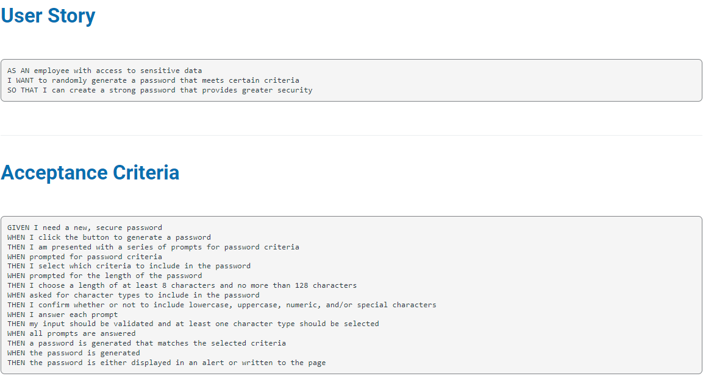

# Password-Generator

## Description
THis project is created to generate random password that meets users criteria. After clicking on Generate Password user will be asked what should the password's length be and what character should be used.  
User can choose the length of password anywhere from 8-128 characters long and has to select at least one groups of characters that he wants password to contain. Once making selection, password will be generated..

---
## Installation 
* Clone the repository  
```
git clone git@github.com:Jelenarog/Password.generator.git
```
---
## Usage


---
## Links
[Github Repository Link](https://github.com/Jelenarog/Password.generator)<br/>
 [Deployed website](https://jelenarog.github.io/Password.generator/)<br/>
 [HTML code](./Asstes/Images/HTML%20code.png)<br/>
 [Jva script](.//Asstes/Images/Java%20script.png)

 ---

 ## Credits
 [Starter code](https://github.com/coding-boot-camp/friendly-parakeet)

  ---
## License 
Please refer to the LICENSE in the repo.

---

